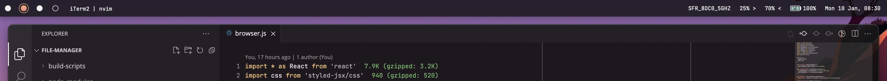
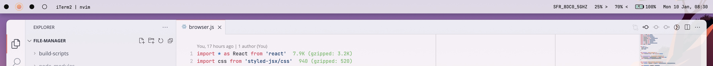

# simple-bar-lite

A [yabai](https://github.com/koekeishiya/yabai) status bar widget for [Übersicht](https://github.com/felixhageloh/uebersicht). This is a simplified version of [simple-bar](https://github.com/Jean-Tinland/simple-bar).

## Features

- 3 themes behaviours: dark, light or automatic (synced with system)
- Display workspace number/label & current space
- Navigate to workspace on click
- Battery, microphone, sound level, wifi, date time widgets out of the box
- You can add your own custom widgets in settings

## Compatibility & requirements

In order to make this custom bar work, you'll need to install both [yabai](https://github.com/koekeishiya/yabai) and [Übersicht](https://github.com/felixhageloh/uebersicht), both of them must be up to date.

**`simple-bar-lite` supports only yabai v4**.

Becareful, for Big Sur users, some actions must be taken in order to make yabai with scripting addition fully operational: [see here for more details](<https://github.com/koekeishiya/yabai/wiki/Installing-yabai-(latest-release)#macos-big-sur---automatically-load-scripting-addition-on-startup>).

`simple-bar-lite` has been tested and is working on Monterey but should work on both Catalina & Big Sur.

**It is important to note that you'll need to use yabai in `bsp` or `stack` layout mode in order to prevent app windows to overlap simple-bar.**

## Preview





## Installation

Clone this repo to your Übersicht widgets directory with the following command.

```bash
$ git clone https://github.com/Jean-Tinland/simple-bar-lite $HOME/Library/Application\ Support/Übersicht/widgets/simple-bar-lite
```

**Becareful, the folder containing the widget must be named `simple-bar-lite`, otherwise, simple-bar-lite will never launch.**

[JetBrains Mono](https://www.jetbrains.com/lp/mono/) is used by default. You can set your own font in the `custom-settings.json` file.

### For users with a custom yabai install (path)

You can set your custom yabai path in the `custom-settings.json` file.

## Usage

After cloning the project, simply activate it in Übersicht's widgets list.

- `simple-bar-main-jsx`

## Clickable elements

Some elements of **simple-bar** are interactives. For example :

- Spaces indicator (trigger switch to clicked space)
- If you set an "onClickCommand" for a particular widget in `custom-settings.json`, it will be triggered when you click on the widget.

Clickable elements have a colored background showing up on hover in order to easily identify them.

## Customization & settings

If you want to customize the colors, shadows, fonts, etc... you can simply setup your own theme in the `custom-settings.json` file.

You can copy the content of `default-settings.json` file in your `custom-settings.json` and change the values.

Alongside the theme customization, you will find all the other settings you can customize.

### All the settings

Coming soon!
